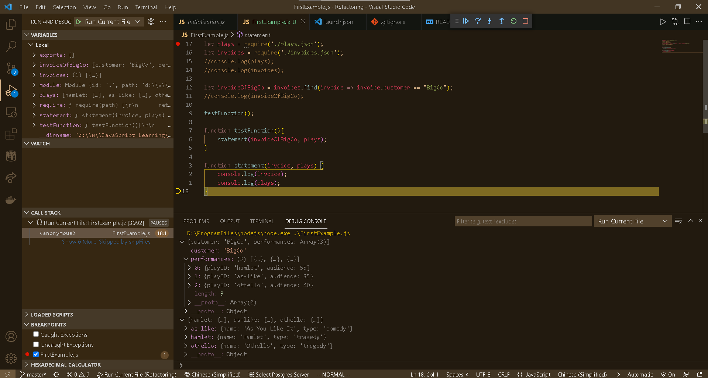

# 如何运行当前 JS 文件时加载外部文件的 JSON 数据

## 使用全局 require 函数即可

```javascript
let plays = require('./plays.json');
let invoices = require('./invoices.json');
//console.log(plays);
//console.log(invoices);

let invoiceOfBigCo = invoices.find(invoice => invoice.customer == "BigCo");
//console.log(invoiceOfBigCo);

testFunction();

function testFunction(){
    statement(invoiceOfBigCo, plays);
}

function statement(invoice, plays) {
    console.log(invoice);
    console.log(plays);
}
```

**运行结果**：

